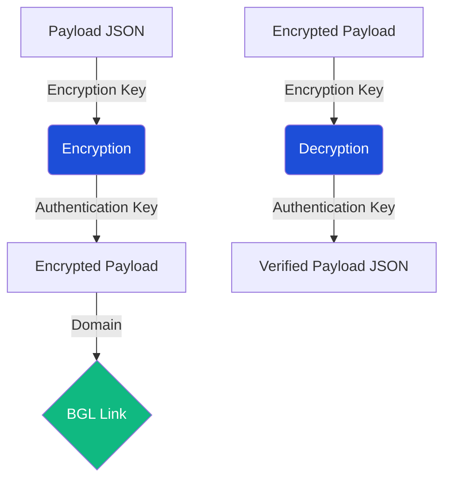

# BGL - Business Generated Link Tool


**BGL** is a powerful utility for generating and troubleshooting **Business Generated Links** for Trustpilot. It provides a modern, fast, and secure way to handle payload encryption and decryption for business integrations.

## 🚀 Features

- **Quick Encryption**: Easily generate secure links with any JSON payload.
- **Instant Decryption**: Decode existing BGL payloads for debugging and verification.
- **Modern UI**: A sleek "midnight" theme built with Flet for a premium experience.
- **Robust Security**: AES-CBC encryption and HMAC-SHA256 integrity checks.
- **Fast Setup**: Managed with `uv` for seamless dependency and environment handling.

---

## 🛠️ Installation

This project uses [uv](https://github.com/astral-sh/uv) for fast and reliable dependency management.

1. **Clone the repository**:
   ```bash
   git clone https://github.com/henrikriisehansen-droid/BGL.git
   cd BGL
   ```

2. **Run the application**:
   `uv` will automatically create a virtual environment and install dependencies the first time you run it.
   ```bash
   uv run python main.py
   ```

---

## 📖 Usage

### Workflow Overview



### Encryption
1. Get your **Encryption Key** and **Authentication Key** from the [Trustpilot Business Portal](https://businessapp.b2b.trustpilot.com/invitations/business-generated-links).
2. Enter your **Domain** (e.g., `example.com`).
3. Provide the **Payload** in JSON format.
4. Click **Encrypt** to generate your Business Generated Link.
5. Use **Copy Link** or **Open Link** to use the result.

### Decryption
1. Paste the **Encrypted Payload** into the "Payload to Decrypt" field.
2. Ensure you have the correct **Keys** entered in the encryption section.
3. Click **Decrypt** to view the original JSON data.

---

## 📦 Automated Releases

This project is configured with GitHub Actions to automatically build and release the application for **Windows** and **macOS**.

To create a new release:
1. **Tag your commit**:
   ```bash
   git tag v1.0.0
   ```
2. **Push the tag**:
   ```bash
   git push origin v1.0.0
   ```
GitHub Actions will then build the binaries and attach them to a new GitHub Release.

---

## 🔧 Troubleshooting

- **Invalid Base64**: Ensure your keys are exactly as they appear in the Trustpilot dashboard.
- **Integrity Error**: This usually means the **Authentication Key** is incorrect or the payload has been modified.
- **Padding Error**: Double-check your **Encryption Key**.
- **JSON Format**: Ensure your payload is valid JSON (use double quotes for keys and values).

---

## 🤝 Contributing

Contributions are welcome! Please ensure you use `uv` for development and follow the existing coding style.

**Author**: [henrikriisehansen-droid](https://github.com/henrikriisehansen-droid)
